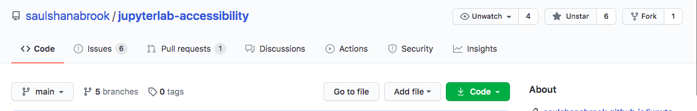

# 🌳 Github

### 🗄 What is Github?
* GitHub is like google drive + soundcloud + facebook for coders, a place to store code, post, share and discuss. 
* GitHub is built on Git which is a software for tracking changes. Everyone can independently work on their own copy of the code, and merge the changes together from different branches.

### 💩 What is a GitHub Repository?
* This group is a GitHub Repository (not suppository)! Repository or "repo" as they say in the biz is a collection of files and discussions, basically a digital filing cabinet. 
* Every Github repo starts with a readme, a welcome first page. 📖 

### 🌴 What are GitHub branches?
* GitHub is a collaborative project, and so people can have different branches of what they're working on. 
* On GitHub you work on your own branch, which is a copy of the main code.

### 🔀 How do you make changes on GitHub?
* A Pull Request (PR) is a request to review and modify code. To pull a branch into another branch.
* You can also edit code "locally" by making a copy of the code and editing it on your computer, and when you send it to github from your computer this is called pushing code. 

### ✔️ How to review and merge a pull request?    
* Pull Request Review: Anyone can review any pull request, to say whether they approve of it or not. You can only review pull requests, before they are merged.
* Some projects require a core project person to review pull requests, before they are merged.   
* Merging Pull Request: To actually modify the branch to add the new code.

### 👔 What is GitHub Etiquette?
* You should comment when you are working on something on the issue, to avoid many people doing the same work. If multiple people edit the same section then you have to manually merge which is annoying. 

## 🤙 DIY

1. Make a GitHub Account username/password, https://github.com/
2. Watch and star our GitHub repo https://github.com/saulshanabrook/jupyterlab-accessibility, this will give you notifications. 
 Side note, this is the main [JupyterLab](https://github.com/jupyterlab/jupyterlab) repository, but you don't need to subscribe since it's a lot. 
 3. Peruse around the repo, you can see the readme, issues, pull requests, discussion, and insights. 
 

## 💡 More resources
*   HelloWorld Guide
*   Layout of Projects
 
 ## 🤓 Quiz
 

  
What software for tracking changes is GitHub built on? 

  Git

