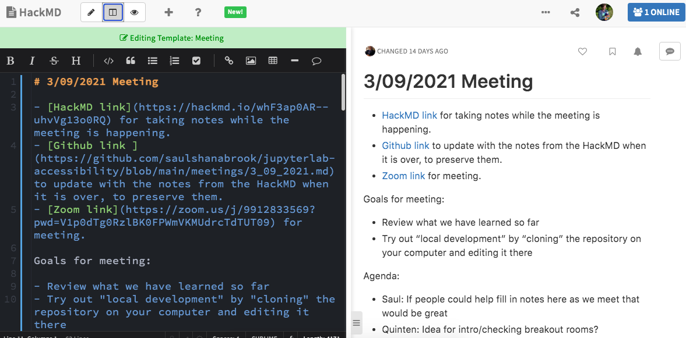

# 💬 Markdown

## ✍️ Markdown

* Markdown is the easiest programming language to learn and where we'll start! 
* Markdown is written in plain text, with different syntax to add formatting, such as:
  * lists
  * making text **bold** or *italicized*
  * writing headers, starting with # for the title, ## subtitle, and ### sub sub title etc
  * We can also link to websites like [markdown coverted to html](https://markdowntohtml.com/)

```markdown
## ✍️ Markdown

* Markdown is the easiest programming language to learn and where we'll start! 
* Markdown is written in plain text, with different syntax to add formatting, such as:
    * lists
    * making text **bold** or *italicized*
    * writing headers, starting with # for the title, ## subtitle, and ### sub sub title etc
    * We can also link to websites like [markdown coverted to html](https://markdowntohtml.com/)
```

### HackMD
* We are taking meeting notes on HackMD in markdown because it easily converts to being on a website and it is good practice. Here's an example of the [meeting notes](https://hackmd.io/whF3ap0AR--uhvVg13o0RQ)
* The different colors indicate how indented the text is, and links are in green. 
* For the symbols at the top, the pencil is to edit in markdown, the split screen is to see both markdown and preview the text, and the eye is to view normally. 
* Markdown files ends in .md (it's like .pdf or .doc), so if you create a markdown file remember to end the name with .md
* The GitHub README, guides, and meeting notes are all written in markdown. 



## 🤙 DIY 
* Try out writing in markdown using this website https://markdowntohtml.com/

## 💡 Resources
* [Github guide to markdown](https://guides.github.com/features/mastering-markdown/)
